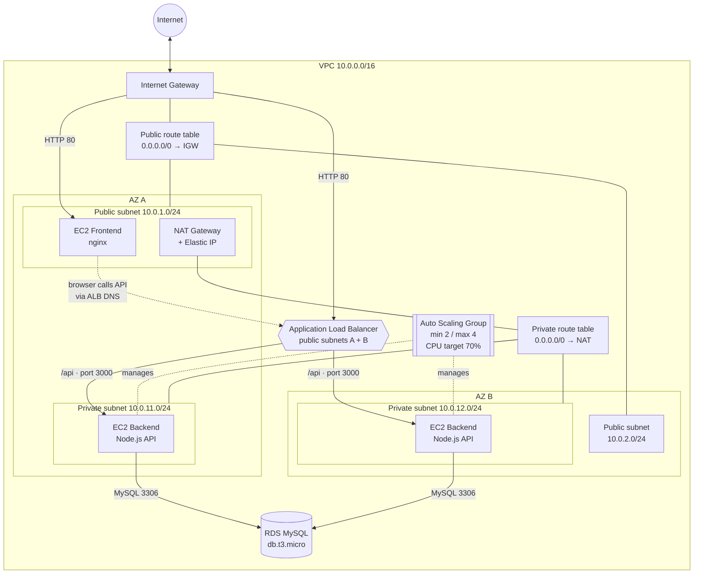
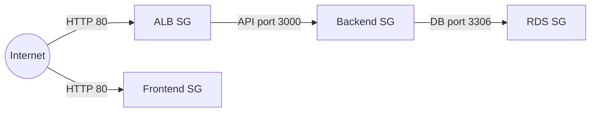

# AWS Highly-Available Full-Stack Deployment with Terraform

[](https://github.com/samibhiri/aws-terraform-ha-fullstack/actions/workflows/terraform-ci.yml)

Deploying a full-stack web application on AWS using Terraform: custom VPC,
load balancing, auto scaling and a managed database.

🚧 **Work in progress**: the infrastructure is being built step by step.

## Roadmap

- [x] Networking (VPC, subnets, gateways)
- [x] Security groups
- [x] Database (RDS)
- [x] Backend (EC2, Auto Scaling, Load Balancer)
- [x] Frontend
- [x] CI pipeline (GitHub Actions): `fmt`, `validate` and `tflint` on every pull request
- [ ] End-to-end deployment and resilience demo

## Architecture (current state)


```mermaid
flowchart TB
    internet((Internet))

    subgraph VPC["VPC 10.0.0.0/16"]
        igw[Internet Gateway]
        rtpub[Public route table<br/>0.0.0.0/0 → IGW]
        rtpriv[Private route table<br/>0.0.0.0/0 → NAT]

        subgraph AZA["AZ A"]
            subgraph pubA["Public subnet 10.0.1.0/24"]
                fe[EC2 Frontend<br/>nginx]
                nat[NAT Gateway<br/>+ Elastic IP]
            end
            subgraph privA["Private subnet 10.0.11.0/24"]
                be1[EC2 Backend<br/>Node.js API]
            end
        end

        subgraph AZB["AZ B"]
            pubB[Public subnet<br/>10.0.2.0/24]
            subgraph privB["Private subnet 10.0.12.0/24"]
                be2[EC2 Backend<br/>Node.js API]
            end
        end

        alb{{Application Load Balancer<br/>public subnets A + B}}
        asg[[Auto Scaling Group<br/>min 2 / max 4<br/>CPU target 70%]]
        rds[(RDS MySQL<br/>db.t3.micro)]
    end

    internet <--> igw
    igw --- rtpub
    rtpub --- pubA
    rtpub --- pubB
    nat --- rtpriv
    rtpriv --- privA
    rtpriv --- privB
    igw -->|HTTP 80| fe
    fe -. "browser calls API<br/>via ALB DNS" .-> alb
    igw -->|HTTP 80| alb
    alb -->|/api · port 3000| be1
    alb -->|/api · port 3000| be2
    asg -.manages.- be1
    asg -.manages.- be2
    be1 -->|MySQL 3306| rds
    be2 -->|MySQL 3306| rds
```

## Network design

| Subnet | AZ | CIDR | Routing |
|---|---|---|---|
| Public 1 | A | 10.0.1.0/24 | Internet Gateway |
| Public 2 | B | 10.0.2.0/24 | Internet Gateway |
| Private 1 | A | 10.0.11.0/24 | NAT Gateway (outbound only) |
| Private 2 | B | 10.0.12.0/24 | NAT Gateway (outbound only) |

A single NAT Gateway is used to keep costs low; a production setup would use one per AZ.

## Security design

Security groups are chained by **security group reference** rather than IP ranges:
each layer only accepts traffic from the layer directly in front of it.


```mermaid
flowchart LR
    internet((Internet)) -->|HTTP 80| alb[ALB SG]
    alb -->|API port 3000| backend[Backend SG]
    backend -->|DB port 3306| rds[RDS SG]
    internet -->|HTTP 80| frontend[Frontend SG]
```

| Security group | Inbound | Source |
|---|---|---|
| ALB | TCP 80 | `0.0.0.0/0` |
| Backend | TCP 3000 (API) | ALB security group only |
| RDS | TCP 3306 (MySQL) | Backend security group only |
| Frontend | TCP 80 | `0.0.0.0/0` |

- No SSH is opened anywhere: instances are administered through **AWS Systems Manager Session Manager**.
- The database has no outbound rule, as it never needs to initiate connections.

## Database

- **Amazon RDS for MySQL 8.0**, `db.t3.micro`, 20 GB gp3 storage
- Deployed in a **DB subnet group** spanning both private subnets
- `publicly_accessible = false`: the database has no public endpoint
- Single-AZ to limit costs (Multi-AZ would be enabled in production)

### Secrets handling

The master password is **never stored in the code**. It is declared as a
`sensitive` Terraform variable with no default value, and supplied at runtime:

```bash
export TF_VAR_db_password='<strong-password>'
```

Alternatively, copy `terraform/terraform.tfvars.example` to `terraform.tfvars`
(git-ignored) and fill in the values.

## Backend

### Application

A minimal **Node.js / Express** REST API (`backend/`) backed by MySQL:

| Endpoint | Description |
|---|---|
| `GET /health` | Health check (returns `200 OK`) |
| `GET /api/messages` | List messages |
| `POST /api/messages` | Create a message (`{ "content": "..." }`) |

All connection settings are read from environment variables: no secret lives in the code.

### Compute

- **Launch Template**: Ubuntu 24.04 LTS, `t3.micro`, backend security group, IAM instance profile for SSM
- **User Data** (rendered with Terraform `templatefile()`): installs Node.js, clones this repository,
  installs dependencies and runs the API as a **systemd service** (auto-restart, starts on boot)
- **Auto Scaling Group**: min 2 / desired 2 / max 4 instances, spread across both private subnets

Every new instance bootstraps itself: no manual SSH or configuration is ever needed.

### Load balancing and resilience

- **Application Load Balancer** across both public subnets, listening on HTTP 80
- **Target Group** forwarding to the API on port 3000, with a health check on `GET /health`
- The ASG uses **ELB health checks**: an instance whose API stops answering is
  automatically terminated and replaced (self-healing)
- **Target-tracking scaling policy**: the ASG scales out when average CPU exceeds 70 %
  and scales back in when load drops, always between 2 and 4 instances

Users never reach the backend instances directly: all traffic goes
**Internet → ALB → Target Group → EC2**.

## Frontend

- Static **HTML / JavaScript** guestbook (`frontend/`) served by **nginx**
  on an EC2 instance in a public subnet
- Bootstrapped by User Data: installs nginx, clones this repository and copies the static files
- At boot, a `config.js` file is generated with the **ALB DNS name** injected by Terraform:
  the browser always calls the API through the load balancer, never a backend IP
- Administered through SSM Session Manager (no SSH port open)

## Development workflow

- `main` is protected: changes are only merged through **pull requests**
- Every pull request runs the **Terraform CI** workflow (`terraform fmt -check`,
  `terraform validate`, `tflint` with the AWS ruleset); merging is blocked until it passes
- One short-lived branch per topic (e.g. `ci/...`, `feat/...`, `docs/...`), deleted after merge
